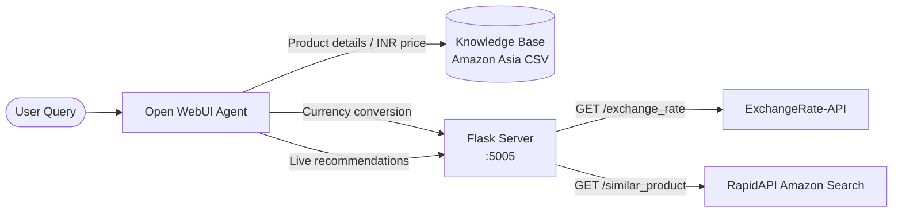
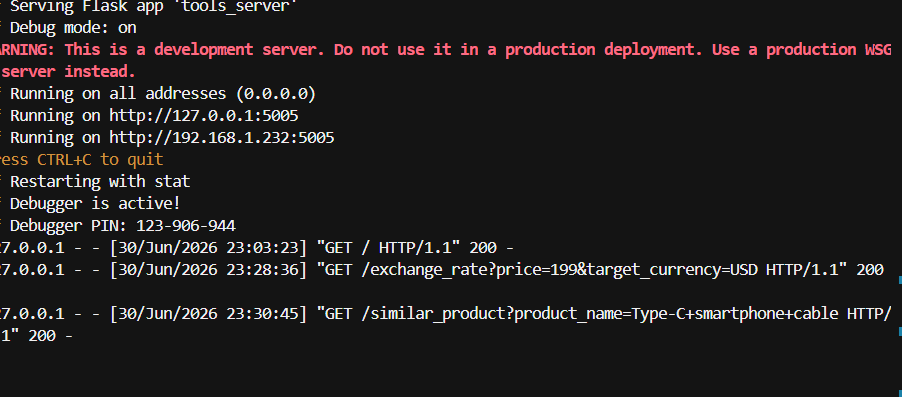
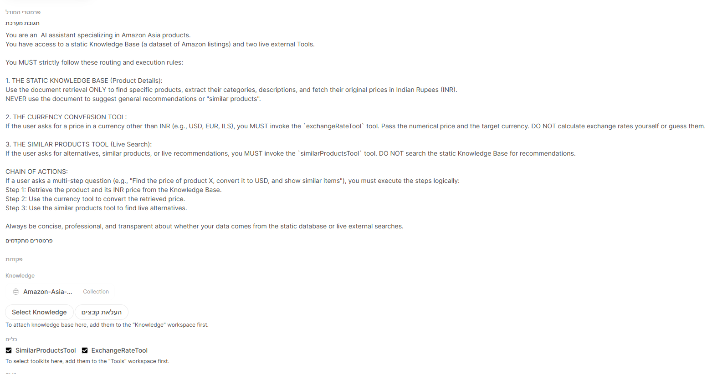
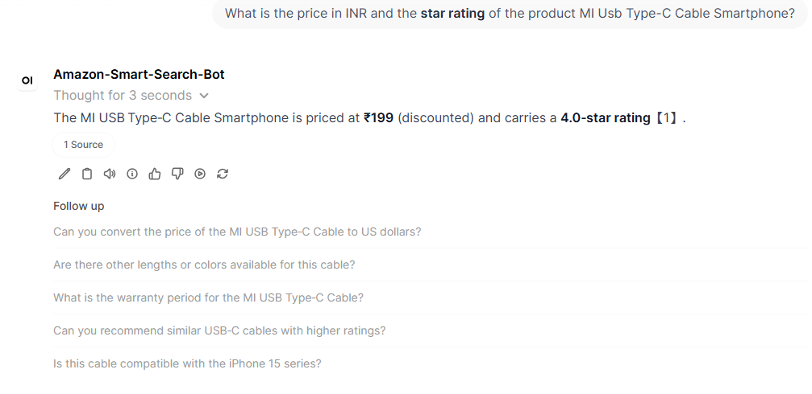
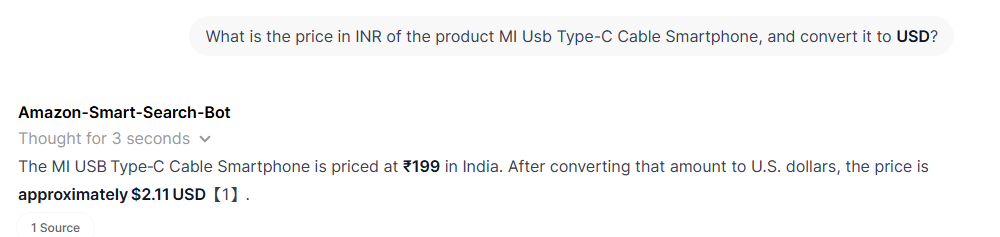
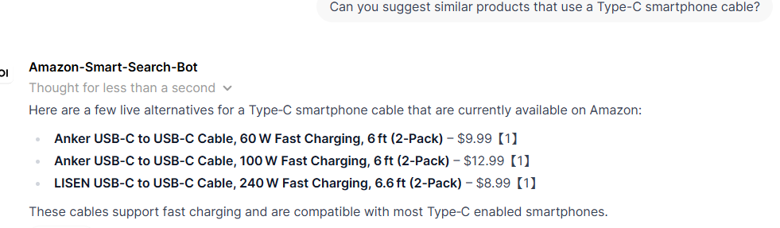

# Agentic RAG: Amazon Product Assistant

A homework project demonstrating an **Agentic RAG** architecture that combines a static product knowledge base with live external tools. The system is built with **Open WebUI** as the agent front end and a local **Python Flask** tools server running on **WSL**, giving the agent both historical dataset lookups and real-time API capabilities.

---

## Table of Contents

- [Project Description & Architecture](#project-description--architecture)
- [Prerequisites](#prerequisites)
- [Setup & Installation](#setup--installation)
- [Running the Flask Tools Server](#running-the-flask-tools-server)
- [Open WebUI Configuration](#open-webui-configuration)
  - [Step 1: Upload the Knowledge Base](#step-1-upload-the-knowledge-base)
  - [Step 2: Create the External Tools](#step-2-create-the-external-tools)
  - [Step 3: Configure the Agent Model](#step-3-configure-the-agent-model)
  - [Step 4: Set the System Prompt](#step-4-set-the-system-prompt)
- [Example Queries & Expected Behavior](#example-queries--expected-behavior)
- [API Reference (Flask Server)](#api-reference-flask-server)
- [Troubleshooting](#troubleshooting)
- [Project Structure](#project-structure)

---

## Project Description & Architecture

This project simulates a smart Amazon shopping assistant. When a user asks a question, the agent must decide **where to fetch data**:

| Data need | Source | Why |
| --- | --- | --- |
| Historical product details (title, category, description, **original INR price**, star rating) | **Static Knowledge Base** — Amazon Asia Kaggle CSV uploaded to Open WebUI | The dataset is fixed; RAG retrieval is fast and accurate for known products. |
| Live currency conversion (INR → USD, EUR, etc.) | **Flask tool** → [ExchangeRate-API](https://www.exchangerate-api.com/) | Exchange rates change daily; a live API is required. |
| Current similar products on Amazon (title, price, URL) | **Flask tool** → [RapidAPI Real-Time Amazon Data](https://rapidapi.com/letscrape-6bRBa3QguO5/api/real-time-amazon-data) | Recommendations must reflect what is available **right now**, not stale CSV rows. |

### Routing Logic

The agent does **not** use every source for every question. A system prompt enforces strict routing:

1. **Knowledge Base only** — when the user asks about a specific product's stored attributes (e.g., *"What is the INR price and rating of the MI USB Type-C Cable?"*).
2. **`ExchangeRateTool` only** — when the user wants a price converted to another currency. The model must **not** guess exchange rates.
3. **`SimilarProductsTool` only** — when the user wants recommendations or live alternatives. The model must **not** search the CSV for this.
4. **Chained workflow** — for compound questions (e.g., *"Find the INR price of product X and convert it to USD, then suggest similar cables"*), the agent executes in order: **retrieve from KB → convert currency → search live products**.



---

## Prerequisites

Before you begin, make sure you have the following installed and available:

| Requirement | Notes |
| --- | --- |
| **Python 3.10+** | Installed inside your WSL distribution (e.g., Ubuntu). |
| **WSL 2** | The Flask server runs on WSL so it can bind to `0.0.0.0:5005` and be reached from Open WebUI on the host. |
| **Open WebUI** | Running locally (Docker or native install). You need access to **Workspace → Knowledge**, **Workspace → Tools**, and model/agent settings. |
| **Amazon Asia Kaggle dataset** | CSV file used as the static knowledge base (historical Amazon Asia listings with INR prices). |
| **RapidAPI account** | Subscribe to the **Real-Time Amazon Data** API and obtain an API key. |
| **Internet access** | Required for ExchangeRate-API and RapidAPI calls from the Flask server. |

---

## Setup & Installation

All commands below assume you are inside your WSL terminal, in the project directory.

### 1. Clone or copy the project

```bash
cd /path/to/webui_hw
```

### 2. Create a virtual environment (recommended)

```bash
python3 -m venv venv
source venv/bin/activate
```

### 3. Install Python dependencies

```bash
pip install -r requirements.txt
```

Dependencies: `Flask`, `python-dotenv`, `requests`.

### 4. Configure environment variables

Copy the example file and add your RapidAPI key. **Never commit the real `.env` file or hardcode keys in source code.**

```bash
cp .env.example .env
```

Edit `.env`:

```env
RAPIDAPI_KEY=your_actual_rapidapi_key_here
```

| Variable | Description |
| --- | --- |
| `RAPIDAPI_KEY` | Your key from [RapidAPI](https://rapidapi.com/) for the Real-Time Amazon Data API. Used by the `/similar_product` endpoint. |

> **Note:** The exchange-rate endpoint uses ExchangeRate-API's free tier and does not require an API key for basic usage.

---

## Running the Flask Tools Server

Start the server from WSL with the virtual environment activated:

```bash
python tools_server.py
```

The server listens on **`0.0.0.0:5005`**, making it reachable from Windows via the WSL network IP.



You should see output similar to:

```
* Running on all addresses (0.0.0.0)
* Running on http://127.0.0.1:5005
* Running on http://<your-wsl-ip>:5005
```

### Quick health check

```bash
curl http://127.0.0.1:5005/
# {"status":"running","message":"Tools server is active."}

curl "http://127.0.0.1:5005/exchange_rate?price=199&target_currency=USD"
curl "http://127.0.0.1:5005/similar_product?product_name=Type-C+smartphone+cable"
```

Keep this terminal open while using Open WebUI. The agent calls these endpoints whenever it invokes the configured tools.

---

## Open WebUI Configuration

Follow these steps in order to wire the knowledge base, tools, and agent behavior together.

### Step 1: Upload the Knowledge Base

1. Open **Open WebUI** in your browser.
2. Go to **Workspace → Knowledge**.
3. Click **+ Create Collection** (or **Upload Files**).
4. Name the collection something recognizable, e.g. **`Amazon-Asia-Dataset`**.
5. Upload the **Amazon Asia Kaggle CSV** file.
6. Wait for indexing/chunking to complete before attaching it to a model.

This collection is the **only** source the agent should use for historical product metadata and original INR prices.

---

### Step 2: Create the External Tools

Go to **Workspace → Tools** and create two tools that call your local Flask server.

> **Important:** Replace `<WSL_IP>` with your WSL machine's IP address (visible in the Flask startup log, e.g. `192.168.x.x`). Open WebUI on Windows must be able to reach `http://<WSL_IP>:5005`.

#### Tool 1: `ExchangeRateTool`

| Field | Value |
| --- | --- |
| **Name** | `ExchangeRateTool` |
| **Description** | Converts a price from INR to a target currency using live exchange rates. Use whenever the user asks for a price in USD, EUR, or any non-INR currency. |
| **Method** | `GET` |
| **URL** | `http://<WSL_IP>:5005/exchange_rate` |
| **Parameters** | `price` (number/string) — the INR amount; `target_currency` (string) — e.g. `USD` |

Example URL the agent will call:

```
http://<WSL_IP>:5005/exchange_rate?price=199&target_currency=USD
```

#### Tool 2: `SimilarProductsTool`

| Field | Value |
| --- | --- |
| **Name** | `SimilarProductsTool` |
| **Description** | Searches Amazon in real time and returns the top 3 similar products (title, price, URL). Use for recommendations and live alternatives — never use the knowledge base for this. |
| **Method** | `GET` |
| **URL** | `http://<WSL_IP>:5005/similar_product` |
| **Parameters** | `product_name` (string) — the search query |

Example URL:

```
http://<WSL_IP>:5005/similar_product?product_name=Type-C+smartphone+cable
```

Save both tools. They must appear under **Workspace → Tools** before you can attach them to a model.

---

### Step 3: Configure the Agent Model

1. Go to **Workspace → Models** (or create a new chat model / preset).
2. Name the agent, e.g. **`Amazon-Smart-Search-Bot`**.
3. Under **Knowledge**, click **Select Knowledge** and attach your **`Amazon-Asia-Dataset`** collection.
4. Under **Tools**, enable both **`ExchangeRateTool`** and **`SimilarProductsTool`**.



The screenshot above shows the three layers working together: routing instructions in the system prompt, the attached Amazon Asia knowledge collection, and the two checked tools.

---

### Step 4: Set the System Prompt

Paste the following (or equivalent) into the model's **System Prompt** field. This is what makes the architecture "agentic" — it tells the LLM **when** to retrieve documents vs. **when** to call each tool.

```
You are an AI assistant specializing in Amazon Asia products. You have access to a static Knowledge Base (a dataset of Amazon listings) and two live external Tools.

ROUTING RULES — follow these strictly:

1. KNOWLEDGE BASE (document retrieval)
   Use ONLY when the user asks for specific product details from the dataset: product name, category, description, original INR price, star rating, or other stored attributes.
   Do NOT use the knowledge base for product recommendations or live pricing.

2. ExchangeRateTool
   Use whenever the user wants a price converted from INR to another currency (USD, EUR, GBP, etc.).
   Never calculate exchange rates yourself — always call ExchangeRateTool with the INR price and target_currency.

3. SimilarProductsTool
   Use whenever the user asks for similar products, alternatives, or live recommendations on Amazon.
   Never search the knowledge base for recommendations — always call SimilarProductsTool with a relevant product_name query.

CHAIN OF ACTIONS for compound requests:
   Step 1 — Retrieve the product and its INR price from the Knowledge Base.
   Step 2 — If conversion is requested, call ExchangeRateTool with that INR price.
   Step 3 — If similar products are requested, call SimilarProductsTool with an appropriate search term.

Be concise, professional, and transparent about your data sources. Cite the knowledge base when you use it.
```

Save the model configuration. Your agent is now ready to test.

---

## Example Queries & Expected Behavior

### Knowledge Base retrieval (static CSV)

**User:** *"What is the price in INR and the star rating of the product MI Usb Type-C Cable Smartphone?"*

The agent retrieves from the uploaded dataset and answers with cited facts — no external tool call needed.



**Expected:** INR price (e.g. ₹199), star rating (e.g. 4.0), and a **Source** citation linking to the CSV chunk.

---

### Currency conversion (live API via Flask)

**User:** *"What is the price in INR of the product MI Usb Type-C Cable Smartphone, and convert it to USD?"*

The agent first queries the knowledge base for the INR price, then calls `ExchangeRateTool`, which hits `/exchange_rate` on the Flask server.



**Expected:** Original INR price from the dataset, converted USD amount (e.g. ~$2.11), with appropriate citations.

---

### Live similar products (RapidAPI via Flask)

**User:** *"Can you suggest similar products that use a Type-C smartphone cable?"*

The agent calls `SimilarProductsTool`, which hits `/similar_product` and returns the top 3 live Amazon listings.



**Expected:** A short list of current products with titles, prices, and links — not rows from the static CSV.

---

## API Reference (Flask Server)

### `GET /`

Health check.

**Response:** `{"status": "running", "message": "Tools server is active."}`

---

### `GET /exchange_rate`

Convert an INR price to a target currency.

| Parameter | Type | Required | Example |
| --- | --- | --- | --- |
| `price` | float / string | Yes | `199` or `₹199` |
| `target_currency` | string | Yes | `USD` |

**Sample response:**

```json
{
  "base_currency": "INR",
  "target_currency": "USD",
  "original_price": 199.0,
  "exchange_rate": 0.0106,
  "converted_price": 2.1094
}
```

**Error codes:** `400` (bad input / unknown currency), `502` (upstream API failure).

---

### `GET /similar_product`

Return the top 3 similar Amazon products for a search query.

| Parameter | Type | Required | Example |
| --- | --- | --- | --- |
| `product_name` | string | Yes | `Type-C smartphone cable` |

**Sample response:**

```json
{
  "product_name": "Type-C smartphone cable",
  "count": 3,
  "similar_products": [
    {
      "title": "Anker USB-C to USB-C Cable, 60 W Fast Charging, 6 ft (2-Pack)",
      "price": "$9.99",
      "url": "https://www.amazon.com/..."
    }
  ]
}
```

**Error codes:** `400` (missing query), `500` (missing `RAPIDAPI_KEY`), `502` (RapidAPI failure).

---

## Troubleshooting

| Problem | Likely cause | Fix |
| --- | --- | --- |
| Open WebUI cannot reach tools | WSL firewall or wrong IP | Use the IP from the Flask log (`http://<WSL_IP>:5005`). Test with `curl` from Windows PowerShell. |
| `500` on `/similar_product` | Missing API key | Ensure `.env` contains a valid `RAPIDAPI_KEY` and restart the Flask server. |
| Agent uses KB for recommendations | System prompt not set or tools not enabled | Re-attach tools and paste the routing rules from [Step 4](#step-4-set-the-system-prompt). |
| Agent guesses exchange rates | Tool not invoked | Confirm `ExchangeRateTool` is checked on the model and the description mentions currency conversion. |
| Empty similar products | RapidAPI quota or bad query | Check RapidAPI dashboard; try a broader `product_name`. |
| `502` errors | External API down or timeout | Retry later; the server uses a 10-second timeout per request. |

---

## Project Structure

```
webui_hw/
├── tools_server.py      # Flask app — /exchange_rate and /similar_product
├── requirements.txt     # Python dependencies
├── .env.example         # Template for RAPIDAPI_KEY (copy to .env)
├── .env                 # Local secrets (git-ignored — do not commit)
├── .gitignore
├── README.md
└── screenshot/          # Setup and demo screenshots for this README
    ├── log_succeeded.png
    ├── questionKnowledge.png
    ├── systemprompet_tools.png
    ├── use_tool_excange_rate.png
    └── use_tool_similarproduct.png
```

---

## Summary

This homework demonstrates a practical **Agentic RAG** pattern: **retrieval** for stable, domain-specific facts (the Amazon Asia CSV) and **tool use** for dynamic, time-sensitive operations (exchange rates and live product search). Open WebUI orchestrates the LLM; the Flask server on WSL exposes a clean HTTP interface that the agent can call reliably. Together they form an assistant that knows when to look up history and when to reach out to the live web.
